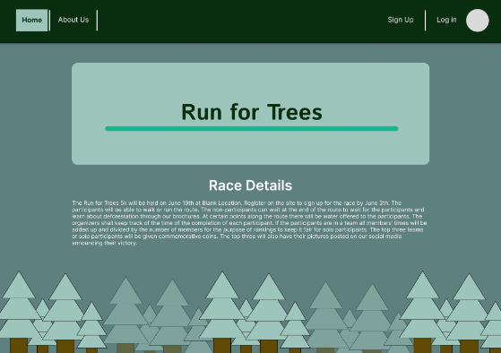
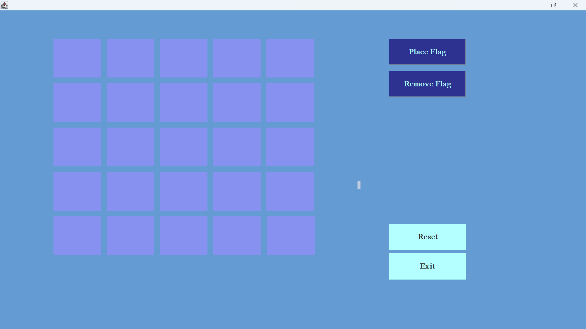
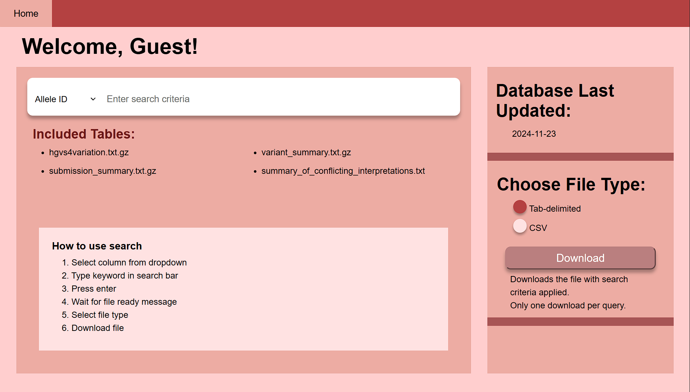
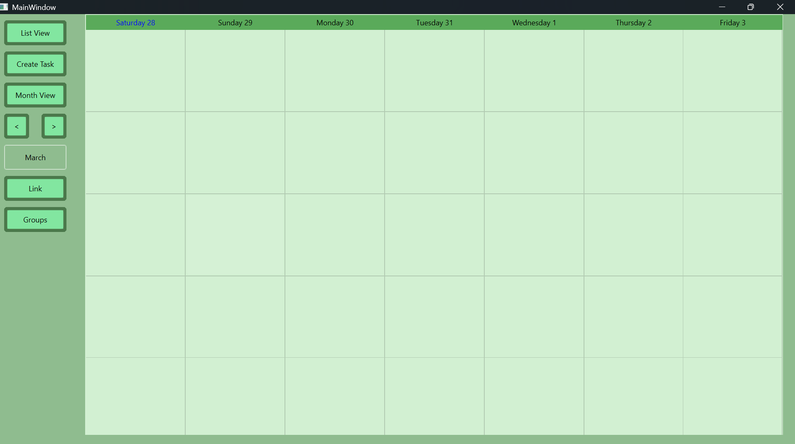

Portfolio
=========

Programming Projects
--------------------

*For access to my private project repositories, please [email me](mailto:Racabanellas2018@gmail.com?subject=GitHub%20Access) with the subject line, GitHub Access.

---
### [5k run Charity Website | CSCI 334](project1.md)

---
### [Minesweeper captcha login| CSCI 325](project2.md)

---
### [Clinvar Database Search | CSCI 495](project3.md)

---
### [Task Manager | CSCI 499](project4.md)

---

Ethics Papers
-------------

### [Professionals in the Computing field handling Copyright](/pdf/Ethics_301_paper.pdf)

-   **Class:** Survey of Scripting language 
-   **Grade:** A

### [Balancing Reliability and Availability of Technology](/pdf/Ethics_CSCI_315_paper.pdf)

-   **Class:** Data Structure Analysis
-   **Grade:** A

### [Privacy and Anonymity on the Web](/pdf/Ethics_CSCI_415_paper.pdf)

-   **Class:** Algorithms
-   **Grade:** A

---

Presentations
-------------

### [Team User Interface Project](/pdf/Charity_Run_Design.pdf)

- **Class:** USER-INTERFACE PROGRAMMING CSCI 334
- **Grade:** A

### [MIPS32 Processor Control ROM](/pdf/SCP_Presentation.pdf)

- **Class:** COMPUTER ARCHITECTURE CSCI 330
- **Grade:** A

---

Page template forked from <a href="https://github.com/csu-cs/csci-portfolio">CSU-CS</a>

<!-- Remove above link if you don't want to attributive -->
