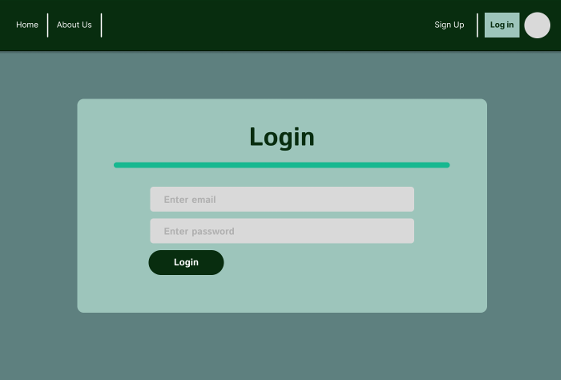
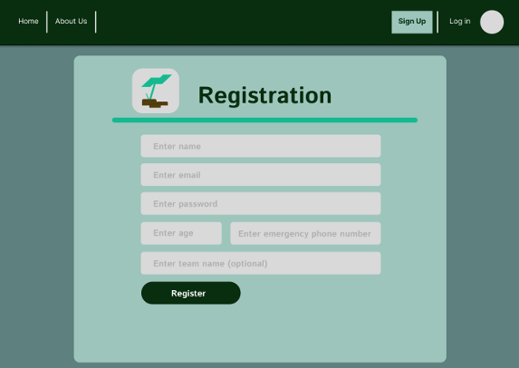
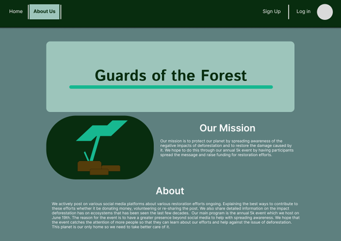
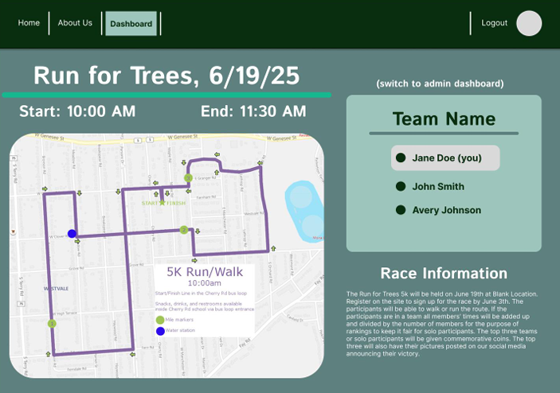
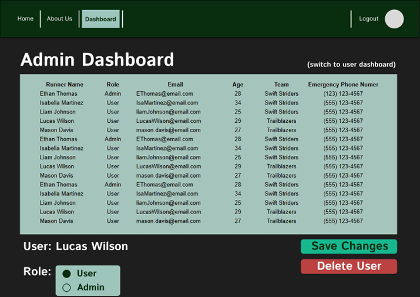

[Back to Portfolio](./)

Website for a 5k Run
===============

-   **Class:** USER-INTERFACE PROGRAMMING
-   **Grade:** A
-   **Language(s):** Ruby, HTML, CSS
-   **Source Code Repository:** [Charity Run](https://github.com/Racabane/charity_run_new)  
    (Please [email me](mailto:racabanellas2018@gmail.com?subject=GitHub%20Access) to request access.)

## Project description

A team project with the goal to create a website for a charity. The purpose of the website is for users to sign-up for the 5K race that the charity is hosting. The website contains additional information about the charity and race details, such as time and location. Unfortunately two team members drop out of the course so as the team lead had to reoganize the schedule and division of tasks. With only two members left I handled the backend related tasks while the other member handled the frontend tasks. 

## How to compile and run the program

clone the repo

```bash
cd charity_run_new
bundle install (Note: have Ruby 3.1.2 installed)
rails db:create
rails db:migrate
rails server
```

Once running the webiste can be accessed with http://localhost:3000

## UI Design

Almost every program requires user interaction, even command-line programs. Include in this section the tasks the user can complete and what the program does. You don't need to include how it works here; that information may go in the project description or in an additional section, depending on its significance.

Lorem ipsum dolor sit amet (see Fig 1), consectetur adipiscing elit, sed do eiusmod tempor incididunt ut labore et dolore magna aliqua. Ut enim ad minim veniam, quis nostrud exercitation ullamco laboris nisi ut aliquip ex ea commodo consequat (see Fig 2). Duis aute irure dolor in reprehenderit in voluptate velit esse cillum dolore eu fugiat nulla pariatur. Excepteur sint occaecat cupidatat non proident, sunt in culpa qui officia deserunt mollit anim id est laborum (see Fig 3).

  
Fig 1. The home screen

  
Fig 2. The login page

  
Fig 3. The sign up page

  
Fig 4. The about page

  
Fig 5. The user content page

  
Fig 6. The admin page


[Back to Portfolio](./)
