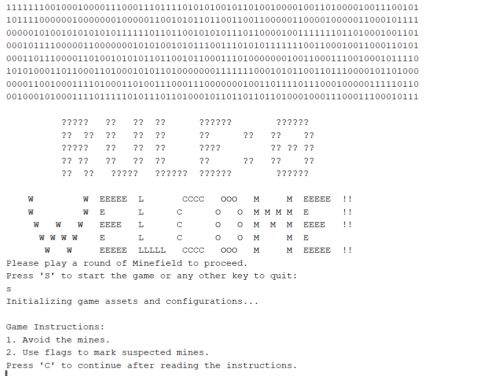
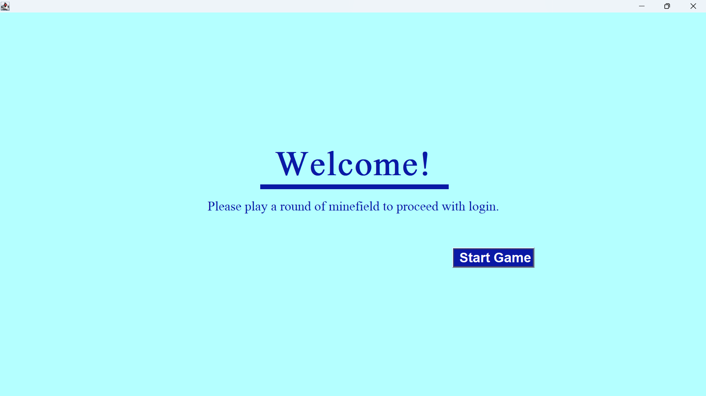
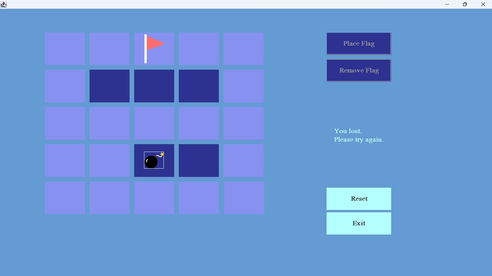
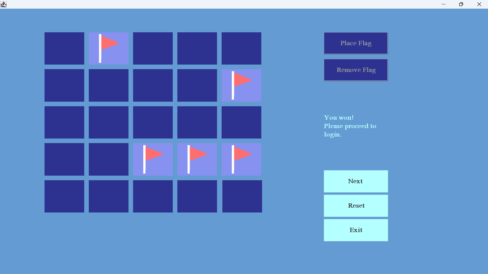
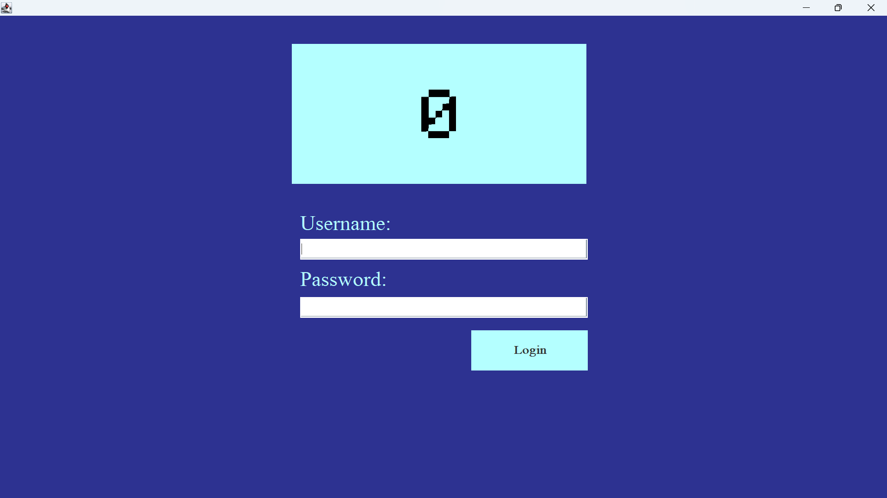

[Back to Portfolio](./)

Minesweeper captcha
===============

-   **Class:** OBJECT-ORIENTED PROGRAMMING
-   **Grade:** A
-   **Language(s):** java
-   **Source Code Repository:** [features/mastering-markdown](https://github.com/Racabane/CSCI-325-Minefield-rc)  
    (Please [email me](mailto:racabanellas2018@gmail.com?subject=GitHub%20Access) to request access.)

## Project description

Lorem ipsum dolor sit amet, consectetur adipiscing elit, sed do eiusmod tempor incididunt ut labore et dolore magna aliqua. Ut enim ad minim veniam, quis nostrud exercitation ullamco laboris nisi ut aliquip ex ea commodo consequat. Duis aute irure dolor in reprehenderit in voluptate velit esse cillum dolore eu fugiat nulla pariatur. Excepteur sint occaecat cupidatat non proident, sunt in culpa qui officia deserunt mollit anim id est laborum.

## How to compile and run the program

Have Apache Netbeans IDE Installed

Import Project Folder Into Netbeans

Run the Project In the IDE

Type Commands In Command Line To Start GUI

## UI Design

Almost every program requires user interaction, even command-line programs. Include in this section the tasks the user can complete and what the program does. You don't need to include how it works here; that information may go in the project description or in an additional section, depending on its significance.

Lorem ipsum dolor sit amet (see Fig 1), consectetur adipiscing elit, sed do eiusmod tempor incididunt ut labore et dolore magna aliqua. Ut enim ad minim veniam, quis nostrud exercitation ullamco laboris nisi ut aliquip ex ea commodo consequat (see Fig 2). Duis aute irure dolor in reprehenderit in voluptate velit esse cillum dolore eu fugiat nulla pariatur. Excepteur sint occaecat cupidatat non proident, sunt in culpa qui officia deserunt mollit anim id est laborum (see Fig 3).

  
Fig 1. The command line start

  
Fig 2. The launch screen after command line

  
Fig 3. The captcha screen

  
Fig 4. A Failed attempt at the captcha

  
Fig 5. A Passed attemp at the captcha

  
Fig 6. The login screen after the captcha

## 3. Additional Considerations

Sed ut perspiciatis unde omnis iste natus error sit voluptatem accusantium doloremque laudantium, totam rem aperiam, eaque ipsa quae ab illo inventore veritatis et quasi architecto beatae vitae dicta sunt explicabo. 

For more details see [GitHub Flavored Markdown](https://guides.github.com/features/mastering-markdown/).

[Back to Portfolio](./)
