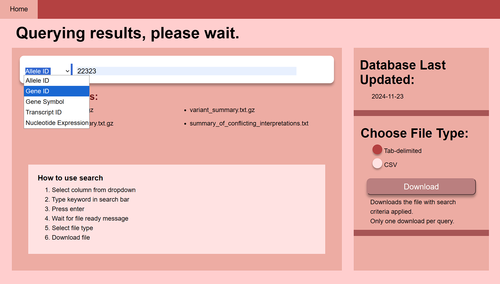
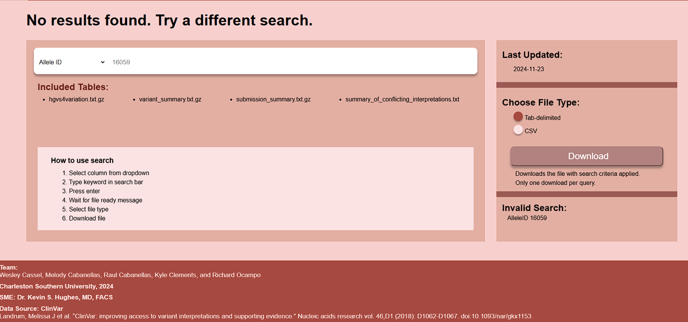
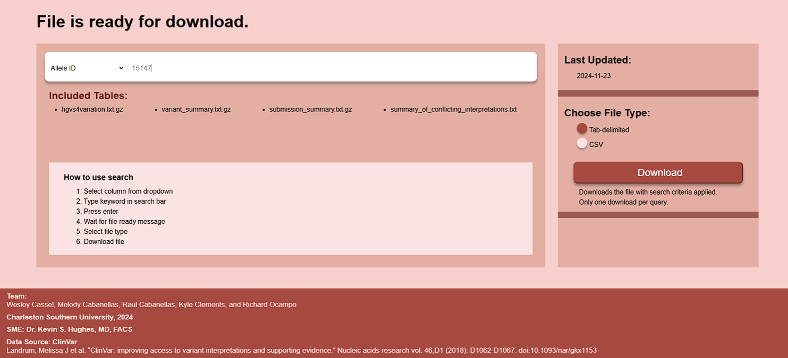

[Back to Portfolio](./)

Clinvar Database Search
===============

-   **Class:** SYSTEMS ANALYSIS & SOFTWARE DESIGN
-   **Grade:** A
-   **Language(s):** HTML, CSS, Java, Javascript, SQL
-   **Source Code Repository:** [RED_TEAM](https://github.com/Racabane/CSCI_495_RED_TEAM)  
    (Please [email me](mailto:racabanellas2018@gmail.com?subject=GitHub%20Access) to request access.)

## Project description

A local hospital doing cancer gene research had the issue of manually going through Clinvar's database to find specific genes and formatting it into a table. Our team project was to create a website for them to enter gene information that would generate the formatted table to save them time. Our project would first download the files from Clinvar's website on a weekly basis. Then filter the data for only certain genes and place the data into a database. Depending on the input from the website it would filter through the database finding all relevant genes. Finally formatting them into a table for a specified file type selected by the user. I handled setting up the database, automating the file downloads from Clinvar and placing the filtered data into the database. While the frontend developer handled the design of the pages, the filter takes in the input from the website to get relevant data. We both worked on integrating how the frontend and backend communicated. The technical writer handled the documentation of the project. While the team lead created the schedule and attempted to host the project but could not find a free option due to the large amount of data needed to be stored. 

## How to compile and run the program

Clone repo

Install Node.js, SQL workbench, SQL server, Java orcale JDK

```bash
cd ./project
npm install
node index.js
```

http://localhost:3000

## UI Design

 (see Fig 1). (see Fig 2). (see Fig 3).


  
Fig 1. The launch screen

  
Fig 2. The screen while it queries

  
Fig 3. When the query fails

  
Fig 3. When the download is ready

[Back to Portfolio](./)
