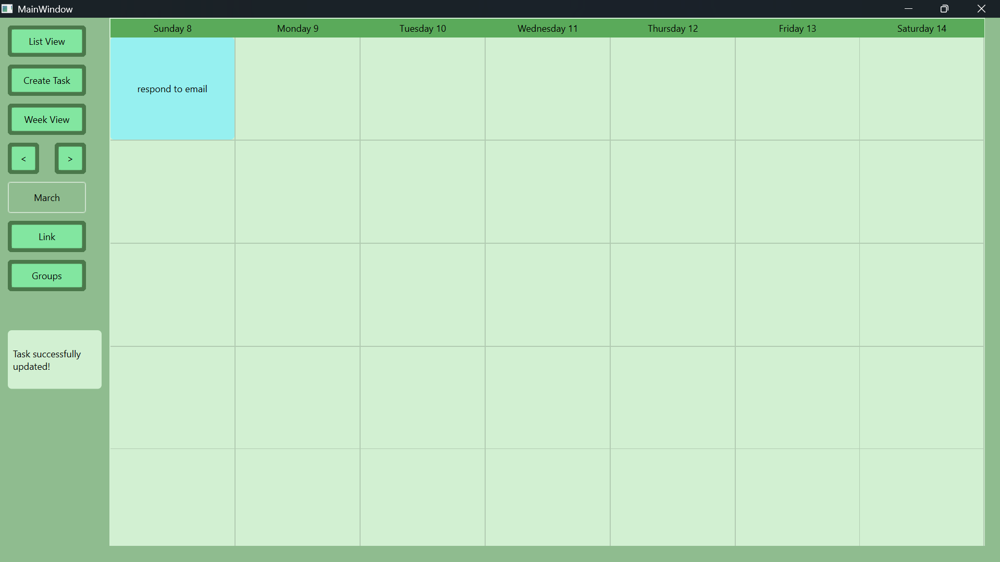
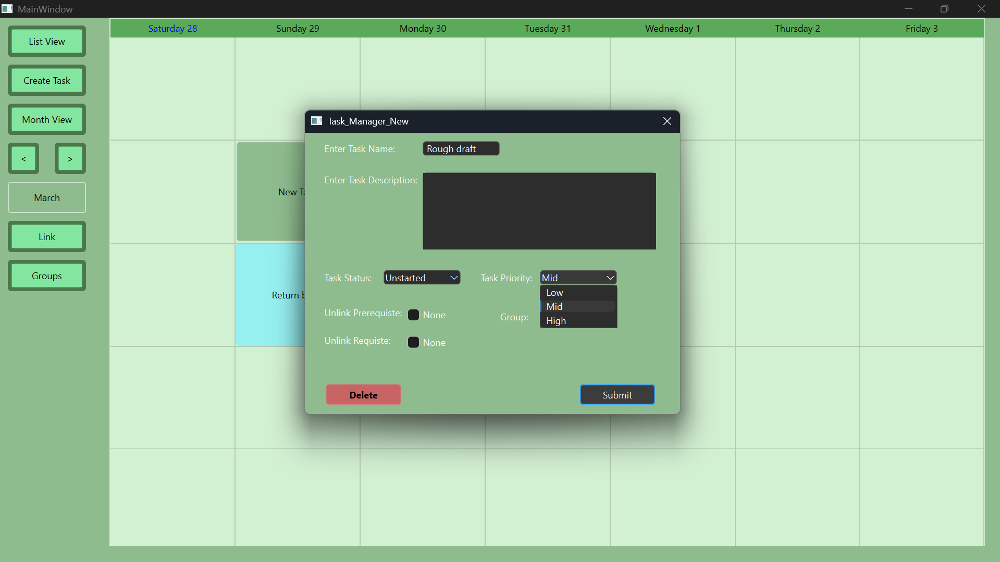
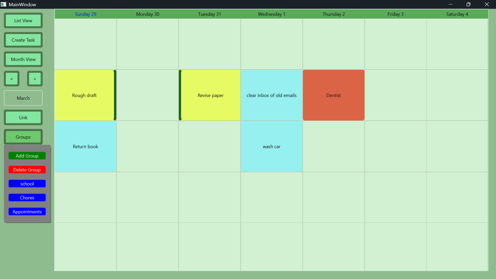
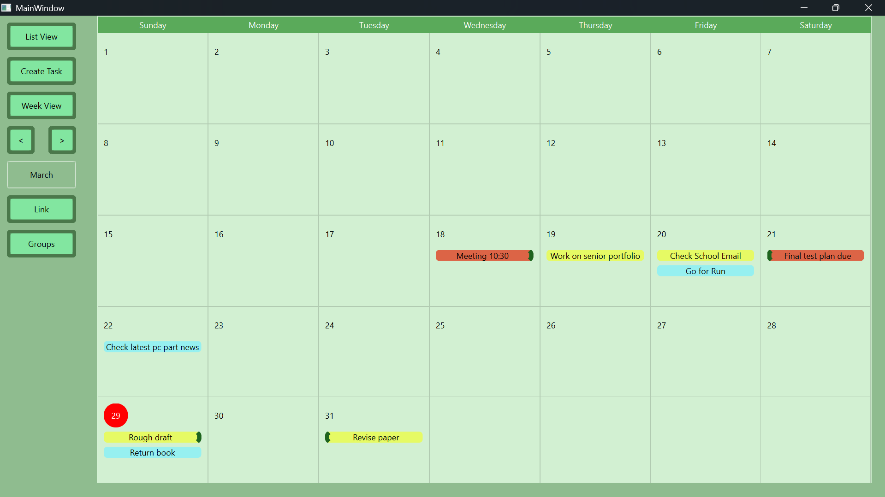
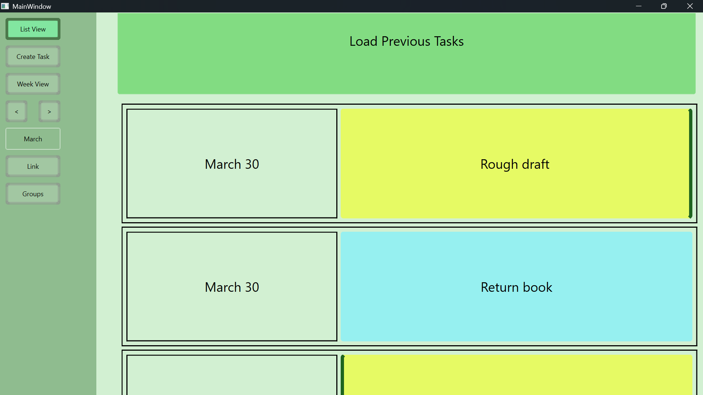

[Back to Portfolio](./)

Task Manager
===============

-   **Class:** Senior Project Implementation/Defense
-   **Grade:** In Progress
-   **Language(s):** C++, CSS
-   **Source Code Repository:** [Senior Project](https://github.com/Racabane/CSU-Senior-Project-RC/tree/master)  
    (Please [email me](mailto:racabanellas2018@gmail.com?subject=GitHub%20Access) to request access.)
-   **Defense Documentation:** [Senior Project](https://github.com/Racabane/CSU-Senior-Project-RC/blob/master/docs/Defense_Documentation.md)

## Project description

The project is to develop a product that can help users with managing their tasks. The product will allow users to create tasks and fill in various details. The product will allow the user to link tasks together along with grouping them. The product will allow users to move and modify tasks and adjust the related linked tasks. The product will have a simple user interface to reduce complexity to allow the user to understand the tool quickly. The product will have the ability to mark tasks status(i.e. To do, in progress, done ). The product will allow the user to mark the importance of the task(i.e. Low priority, mid priority and high priority). These feature all for the purpose of organizing tasks and allowing quick adjustment of tasks.

## Statement of Purpose

Time management is important so being able to create a schedule with all tasks is important. The ideal state of affairs is to allow the user to quickly create their schedule with all necessary details to ensure all tasks can be completed. The user must also be able to readjust their schedule in a short time to meet their needs. The issue of having a large amount of tasks makes it difficult for users to prioritize important tasks, see how tasks relate to one another and see their current progress on the tasks. Users may have to spend the time figuring out these details when managing their extensive amount of tasks. The issue directly goes against the ideal state of affairs as having to spend time on a tool meant to save time makes the product bad. The solution is for the product to have tools for management like marking priority, progress as well as linking and grouping tasks. These tools help users more quickly pick up the details to manage their schedule. The product of a task manager should save the user more time then it takes to set up with the use of easy to use tools.

## Research and Background

The first approach I considered for the project was to make it a website. The reason being that I have seen that there are many websites that function similarly to what I planned for the project. However I was not as familiar with html compared to other programming languages like c++. So I wanted the project to utilize c++ so there would be less of a learning curve. Another issue was the GUI, I was not confident in doing the project purely in c++ so I used Qt Creator. It provided the means to more quickly and easily create and manage the GUI. Another aspect of the project I had considered was adding more advanced project management features to the product. I determined adding these features would make the scope of the project too large. I kept the scope of the project manageable to ensure the goals of the project were not failed.

## Project Language(s), Software and Hardware

C++, CSS and QT Creator 17.0.0

## How to compile and run the program

Clone the repo 

Install QT creator and import the folder as a project

Build the project in release mode 

Move the executable in an empty folder 

Utilize the windeployqt tool that comes with QT Creator to fill the folder with all dependencies 

That folder will now run the application without needing Qt

## Project Requirements
| ID Number: | 1 | 
| :------------- | :------------ |
 | Type:  | Functional  | 
 | Description:  | The ability to create tasks that have a name, description, priority, status. | 
 | Rationale: |  The main focus of the program is on user tasks so the user must be able to create tasks.
 | Fit Criterion:  | A button that causes a form to appear with the text fields Name, Description, Start Date, End Date and prerequisite once submitted causes a box to appear in the schedule.  | 
 | Priority: |  High | 
 | Dependencies:  |  | 

---
| ID Number:    |   2          |
| :------------- | :------------ |
| Type: | look and feel |
| Description: | when creating a task have a pop up appear at the corner of the screen that confirms the creation of the task. |
| Rationale: | The user may require feedback on their action to confirm their action took place correctly. |
| Fit Criterion: | Once a task has been created a confirmation message should appear. |
| Priority: | low |
| Dependencies: | ID 1 |

---
| ID Number: | 3 |
| :------------- | :------------ |
| Type: | Functional |
| Description: | Ability to delete tasks. |
| Rationale: | Wrongful creation of tasks may occur or the task is no longer needed. So the ability for users to remove tasks is needed. |
| Fit Criterion:  | After Clicking on a task that option to delete the task should appear. A pop up will appear once the option is selected asking to confirm deletion of the task. After the confirmation check of deleting the task the box of the corresponding task should disappear from the schedule. |
| Priority: | High |
| Dependencies: | ID1 |

---
| ID Number: | 4| 
| :------------- | :------------ |
| Type: | look and feel| 
| Description: | when deleting a task have a pop up appear at the corner of the screen that confirms the creation of the task.| 
| Rationale: | The user may require feedback on their action to confirm their action took place correctly.| 
| Fit Criterion: | Once a task has been created a confirmation message should appear.| 
| Priority: | Low| 
| Dependencies: | ID 3| 

---
| ID Number: | 5 |
| :------------- | :------------ |
| Type: | Functional | 
| Description: | Ability to modify existing tasks.| 
| Rationale: | Mistakes can occur in the creation of tasks or changes may be necessary after creation. So the ability to  modify tasks is needed. | 
| Fit Criterion: | when selecting a task the option to modify it can be selected. Once selected the detail form of the task should appear that can be edited. The changed data of the task is reflected on the viewing of the task | 
| Priority: | High-Mid | 
| Dependencies: | ID1| 

---
| ID Number: | 6 | 
| :------------- | :------------ |
| Type: | Functional | 
| Description: | Ability to mark tasks status(i.e. To do, in progress, done). | 
| Rationale: | Users may want to keep track of progress on tasks. | 
| Fit Criterion: | A button on the toolbar will have a drop down of statuses after clicking on the status the next task | selected will change to the status. The task box in the schedule will change color based on status selected. | 
| Priority: | Mid-Low | 
| Dependencies: | ID1, ID5 | 

---
| ID Number: | 7 | 
| :------------- | :------------ |
| Type: | Functional | 
| Description: | Ability Mark the importance of the task(i.e. Low priority, mid priority and high priority). | 
| Rationale: | Users may want to focus on tasks that are more important than others. | 
| Fit Criterion: | A button on the toolbar will have a drop down of statuses after clicking on the status the next task selected will change to the status. The task box in the schedule will change border color based on status selected based. | 
| Priority: | Mid-Low | 
| Dependencies: | ID1, ID5 | 

---
| ID Number: | 8 | 
| :------------- | :------------ |
| Type: | Usability | 
| Description: | Ability to drag tasks to different starting dates. | 
| Rationale: | Instead of opening up the task detail form to change the starting date it would be easier for the user to just drag the task. | 
| Fit Criterion: | Once dragged to a new date the detail form of the task should reflect the changed date. | 
| Priority: | Mid | 
| Dependencies: | ID1 | 

---
| ID Number: | 9 | 
| :------------- | :------------ |
| Type: | Functional | 
| Description: | Ability to link tasks for the purpose of creating prerequisite tasks that need to be completed before the other task. | 
| Rationale: | Some tasks may need to be completed before other tasks can begin. To be able to connect them together will help the user to remember the tasks prerequisite. | 
| Fit Criterion: | There will be a button for linking tasks once clicked the user will click on both of the tasks they wish to connect starting with the prerequisite. A visual indication on the respective task that shows a connection with another task after being marked by the user action. The detailed form of the task will also be editable to link tasks by name. | 
| Priority: | High-Mid | 
| Dependencies: | ID1 | 

---
| ID Number: | 10 | 
| :------------- | :------------ |
| Type: | Functional | 
| Description: | Ability to unlink tasks. | 
| Rationale: | The user may be mistaken in thinking certain tasks need to be completed before others and have linked them. So they may require the ability to undo the linking process.
| Fit Criterion: | Once the action to unlink occurs the visual indication of the link should disappear from the respective tasks. | 
| Priority: | Mid | 
| Dependencies: | ID9 | 

---
| ID Number: | 11 | 
| :------------- | :------------ |
| Type: | Functional | 
| Description: | Ability to group tasks to help organize all tasks. | 
| Rationale: | Some tasks may be for different projects that require the ability to distinguish what tasks are related to each other. Groups allow the user to create that distinction. | 
| Fit Criterion: | Next to the group name there should be an add and remove button. The task name should appear on the list of the group. | 
| Priority: | Mid | 
| Dependencies: | ID1 | 

---
| ID Number: | 12 | 
| :------------- | :------------ |
| Type: | functional | 
| Description: | Ability to remove tasks from the group. | 
| Rationale: | Users may need to reorganize the groups so the ability to remove them is necessary. | 
| Fit Criterion: | The Task should no longer appear in the group. | 
| Priority: | Mid | 
| Dependencies: | ID11 | 

---
| ID Number: | 13 | 
| :------------- | :------------ |
| Type: | Usability | 
| Description:  | Ability to highlight all tasks of a certain group. | 
| Rationale: | Users may want to see all tasks of a group more easily on the schedule so making them more noticeable from other tasks should help. | 
| Fit Criterion: | A clear visual change on the schedule differentiating the group tasks from other tasks. | 
| Priority: | Low | 
| Dependencies: | ID11 | 

---
| ID Number: | 14 | 
| :------------- | :------------ |
| Type: | Usability | 
| Description: | When hovering over buttons provide feedback to the user by changing its color or some similar effect. | 
| Rationale: | The user may find it helpful that the button shows indication that it will be pressed before pressing to confirm they are selecting the right button and will actually trigger the tool. | 
| Fit Criterion: | Buttons will change color when hovering on them. | 
| Priority: | Low | 
| Dependencies: | | 

---
| ID Number: | 15 | 
| :------------- | :------------ |
| Type: | Usability | 
| Description: | When clicking on buttons provide feedback to the user by changing its color or some similar effect. | 
| Rationale: | The user will probably find it helpful that the button shows indication that it has been clicked to confirm the user's action. | 
| Fit Criterion: | Buttons will change color when clicking on them. | 
| Priority: | Low | 
| Dependencies: | | 

---
| ID Number: | 16 | 
| :------------- | :------------ |
| Type: | Usability | 
| Description: | Ability to view all tasks in a list order by date | 
| Rationale: | This may be preferable at certain times to simplify the order in which one does tasks. | 
| Fit Criterion: | A button that changes the view into a list of tasks ordered by date| 
| Priority: | Mid-Low | 
| Dependencies: | ID1 | 

---
| ID Number: | 17 | 
| :------------- | :------------ |
| Type: | Look and feel | 
| Description: | Toolbar on screen with all user actions(i.e. Create tasks, groups, mark status, mark priority, link) in the form of buttons to initiate actions. The UI for the tool bar must be simple and tools clear in use. | 
| Rationale: | Keeping all the user tools in one location with clear icons will make it easier for user to understand how to use the product | 
| Fit Criterion: | Toolbar on screen | 
| Priority:|  Mid | 
| Dependencies: | | 

---
| ID Number: | 18 | 
| :------------- | :------------ |
| Type: | Look and feel | 
| Description: | To avoid cluttering the toolbar more options for certain user actions will be displayed upon selecting the action through a drop down menu. Not all user actions will need the drop down menu but things like groups for tasks need to have the ability to create groups, show existing groups, adjust the groups whether it be adding or removing tasks. The drop down menu will help free up the visual space of the product. | 
| Rationale: | There are a lot of actions the user can take but consuming too much screen space will limit the ability to view the actual tasks on the schedule. So having the actions grouped up into drop down menus will alleviate the issue.  | 
| Fit Criterion: | Once a button is clicked that has more tools available a drop down menu will appear.| 
| Priority: | Mid | 
| Dependencies: | ID17 | 

---
| ID Number: | 19 | 
| :------------- | :------------ |
| Type: | Look and feel | 
| Description: | Clear distinction on what days the task is on and the timeframe the slot is supposed to represent. | 
| Rationale: | This helps the user visualize the date for the tasks start instead of having to open up the task details. | 
| Fit Criterion: | A bar or grid that helps show the day the task is scheduled. | 
| Priority: | Mid | 
| Dependencies: | | 

---
| ID Number: | 20 | 
| :------------- | :------------ |
| Type: | functional | 
| Description: | The ability to change the time frame the schedule shows to a month instead of a week. | 
| Rationale: | Depending on how the user is planning it may be necessary for them to view a time frame of greater time than the default of a week. They could also only want to plan for the more immediate or simply focus on the more upcoming tasks so switching to a smaller time frame could give them that focus.  | 
| Fit Criterion: | A button is available in the toolbar to toggle through the various time frames. | 
| Priority: | Mid | 
| Dependencies: |  ID19 | 

## UI Design

The main screen will have most of the tools available in the left tool bar (see Fig 1). The user can create a task using the create button that will create a draggable label. This is to help visualize where the task will be placed when clicking somewhere on the table (see Fig 2). Clicking on the placed task or any task will open its edit menu to change the task's information (see Fig 3). The Group button will cause a dropdown to appear with more tools related to groups such as making or deleting groups. The user may also click on a group to filter the table to show only those tasks (see Fig 4). The Month view button will switch the view from weekly to a monthly view (see Fig 5). The List button will similarly switch the view to a list view (see Fig 6). The user may also navigate to previous or future dates using the two arrows buttons. There is also the Link button that can link two different tasks together.

  
Fig 1. The launch screen

  
Fig 2. Created a task

  
Fig 3. The edit menu of a task

  
Fig 4. The group drop down menu

  
Fig 5. The month view of the manager

  
Fig 6. The list view of the manager

## Project Implementation Description and Explanation

The main window that the user will see when running the program.

The window will have various tools in the left tool bar and the default view of the week starting from the present day.
The ‘create task’ button will add a moveable label on the screen for the user to clearly see where they are placing the task. 

Once the user clicks on one of the empty boxes within the weekly view a blank task will be created.

The blank task will not be saved until some information is placed in the task. This is done in the task edit menu which is opened by clicking on the task.

Once information has been filled in the user can submit the changes. The task is created along with a message confirming its creation.

To delete a task within the same edit menu of the respective task click on the delete button. The task will disappear and a message will appear confirming its removal.

When the user has multiple tasks created they can differentiate by changing their priority in the task edit menu  

setting the priority will change the task visually based on priority low-blue, mid-yellow, high-red

If the user needs one task to be completed before another they can link the two tasks. This is done using the link button that allows the selection of two tasks one to be the prerequisite and the other the requisite.

After submitting the linking the tasks will gain a visual indication. A left border on the task indicates that it has a prerequisite task. A right border indicates that there is a follow up task that can be done after finishing the current one. 

To unlink the tasks the user will click on one of the tasks with the link to open its edit menu. Then click on the unlink prerequisite or unlink requisite box depending on the link that
needs to be removed and submit the changes. The visual indication of the link will disappear.

As there are more tasks the difficulty to manage them increases. Which is why the group button has a dropdown to help the user create and manage groups.

Initially there are no groups so the user will click add group to create a new group

The user will enter a name and submit it in the dialog that appears

The new group will appear in the group dropdown.

To add a task to a group the user will need to open the tasks edit menu by clicking on the respective task. Then in the group dropdown to select the group the user wants it
to be added to. While to remove it from a group using the same dropdown simply select none for the group.

After adding tasks to the school group, the user can click on the ‘school’ button in the dropdown to show only those tasks.

Once clicked the ‘school’ button will change color to show that it is enabled while hiding away the rest of the tasks not belonging to school.

Multiple groups can be enabled at once such as the ‘Appointments’ group showing both tasks from both groups.

Clicking on School will disable the button no longer showing the tasks from school

Clicking on the delete group button within the drop down will allow the user to select a group to delete. Setting all tasks belonging to it back to having no group. 

If the user wants a broader view of their schedule they can view the entire month by clicking on the ‘month view’ button. 

The user may also view their schedule in the form of a list by clicking on the ‘list view’ button. The list will show up to 20 tasks starting from the current day.

The user can view older tasks while in the list view by clicking on the ‘load previous’ button on the top of the list. They can also scroll to the bottom
of the list to click on the ‘load next tasks’ button to view tasks further in the future. While in month and the default weekly view they can utilize the 
two ‘arrow’ buttons below month view to navigate to previous or upcoming months or weeks depending on view. 

As the user makes progress on their tasks they can mark it within the edit menu. 

The task will fade and gray out if marked as done. While if marked as working it will only slightly fade.

## Test Plan
Unofficial testing occurred throughout the development process. However to ensure the project met all requirements a test case was made for each of the project requirements. After the completion of the project it went through these test cases by the developer. If there were any issues it would be fixed then given to a peer that will also go through all these test cases to ensure better examination of the product. Utilizing the feedback and issues found by the peer the project would be adjusted. Then go through its last round of going through the test cases.

## Test Results
| ID | Type          | Test Feature                           | Success Condition                                                                                                  | Date | Result | Comments                                                                                          |
| -- | ------------- | -------------------------------------- | ------------------------------------------------------------------------------------------------------------------ | ---- | ------ | ------------------------------------------------------------------------------------------------- |
| 1  | Functional    | Create a task                          | Box appers in selected slot                                                                                        | 2/9  | Pass   |                                                                                                   |
| 2  | Look and Feel | Creation Confirmation                  | A message appears on main screen that task was created                                                             | 2/9  | Pass   |                                                                                                   |
| 3  | Functional    | Delete a Task                          | The task selected to be deleted disappears from the table                                                          | 2/9  | Pass   |                                                                                                   |
| 4  | Look and Feel | Deletion Confirmation                  | A message appears on main screen that task was deleted                                                             | 2/9  | Pass   |                                                                                                   |
| 5  | Functional    | Modify Task                            | The information of the task is changed the next time its viewed.                                                   | 2/9  | Pass   |                                                                                                   |
| 6  | Functional    | Mark Task as Completed                 | The task will show completed within its form as well as have visual effect applied to the task                     | 2/16 | Pass   |                                                                                                   |
| 7  | Functional    | Set Task Priority                      | The task will show priority within its form as well as have visual effect applied to the task                      | 2/16 | Pass   |                                                                                                   |
| 8  | Usability     | Drag Tasks                             | The task can be moved from its current slot on the table to another                                                | 2/16 | Pass   |                                                                                                   |
| 9  | Functional    | Link Task                              | The task will show linked tasks within its form as well as have visual effect applied to the task                  | 2/16 | Pass   |                                                                                                   |
| 10 | Functional    | UnLink Task                            | The task will no longer show the linked task within its form and the visual effect will be removed                 | 2/16 | Pass   |                                                                                                   |
| 11 | Functional    | Group Task                             | The task will show within its form that it belongs to a group/s                                                    | 2/17 | Pass   |                                                                                                   |
| 12 | Functional    | Remove Task from Group                 | The task will no longer show within its form that it belongs to that group                                         | 2/17 | Pass   |                                                                                                   |
| 13 | Usability     | Display Tasks from specific Group      | The table will only show the tasks belonging to the selected group                                                 | 2/17 | Pass   |                                                                                                   |
| 14 | Usability     | Button Hover Effect                    | Any buttons within the program when hovering over them will have a slight color change to provide feedback to user | 2/17 | Pass   |                                                                                                   |
| 15 | Usability     | Button Click Effect                    | Any buttons within the program when clicking them will have a slight color change to provide feedback to user      | 2/17 | Pass   |                                                                                                   |
| 16 | Usability     | List View                              | The main window will change to show the tasks in a list format instead of a table                                  | 2/17 | Pass   |                                                                                                   |
| 17 | Look and Feel | Tool Bar                               | The users tools will be located in one area                                                                        | 2/17 | Pass   |                                                                                                   |
| 18 | Look and Feel | Dropdown Menu for extended tool options| Any additional options for a user tool will be shown in dropdown                                                   | 2/17 | Pass   |                                                                                                   |
| 19 | Look and Feel | Date Display                           | The heading of the table views will include related dates for the user to associate the task with                  | 2/17 | Pass   |                                                                                                   |
| 20 | Functional    | Month View                             | The table will show all tasks within the month                                                                     | 2/17 | Pass   |                                                                                                   |

---
| Requirement ID | Type          | Test Feature                            | Success Condition                                                                                                  | Date tested | Pass/fail | Comments                                                                                          |
| -------------- | ------------- | --------------------------------------- | ------------------------------------------------------------------------------------------------------------------ | ----------- | --------- | ------------------------------------------------------------------------------------------------- |
| 1              | Functional    | Create a task                           | Box appers in selected slot                                                                                        | 2/22        | Pass      |                                                                                                   |
| 2              | Look and Feel | Creation Confirmation                   | A message appears on main screen that task was created                                                             | 2/22        | Pass      | Add slightly longer onscreen duration                                                             |
| 3              | Functional    | Delete a Task                           | The task selected to be deleted disappears from the table                                                          | 2/22        | Pass      |                                                                                                   |
| 4              | Look and Feel | Deletion Confirmation                   | A message appears on main screen that task was deleted                                                             | 2/22        | Pass      | Add slightly longer onscreen duration                                                             |
| 5              | Functional    | Modify Task                            | The information of the task is changed the next time its viewed.                                                   | 2/22        | Pass      |                                                                                                   |
| 6              | Functional    | Mark Task as Completed                  | The task will show completed within its form as well as have visual effect applied to the task                     | 2/22        | Pass      |                                                                                                   |
| 7              | Functional    | Set Task Priority                       | The task will show priority within its form as well as have visual effect applied to the task                      | 2/22        | Pass      |                                                                                                   |
| 8              | Usability     | Drag Tasks                              | The task can be moved from it current slot on the table to another                                                 | 2/22        | Pass      |                                                                                                   |
| 9              | Functional    | Link Task                               | The task will show linked tasks within its form as well as have visual effect applied to the task                  | 2/22        | Pass      |                                                                                                   |
| 10             | Functional    | UnLink Task                             | The task will no longer show the linked task within its form and the visual effect will be removed                 | 2/22        | Pass      | Some confirmation aside from just visuals.                                                         |
| 11             | Functional    | Group Task                              | The task will show within its form that it belongs to a group/s                                                    | 2/22        | Pass      | An empty group was there. The group list grows beyond screen. Creating more than 10 groups caused a crash. |
| 12             | Functional    | Remove Task from Group                  | The task will no longer show within its form that it belongs to that group                                         | 2/22        | Pass      |                                                                                                   |
| 13             | Usability     | Display Tasks from specific Group       | The table will only show the tasks belonging to the selected group                                                 | 2/22        | Pass      |                                                                                                   |
| 14             | Usability     | Button Hover Effect                     | Any buttons within the program when hovering over them will have a slight color change to provide feedback to user | 2/22        | Pass      |                                                                                                   |
| 15             | Usability     | Button Click Effect                     | Any buttons within the program when clicking them will have a slight color change to provide feedback to user      | 2/22        | Pass      |                                                                                                   |
| 16             | Usability     | List View                               | The main window will change to show the tasks in a list format instead of a table                                  | 2/22        | Pass      | The different tasks look big compared to text size.                                               |
| 17             | Look and Feel | Tool Bar                                | The users tools will be located in one area                                                                        | 2/22        | Pass      |                                                                                                   |
| 18             | Look and Feel | Dropdown Menu for extended tool options | Any additional options for a user tool will be shown in dropdown                                                   | 2/22        | Pass      | So far only groups has dropdown.                                                                  |
| 19             | Look and Feel | Date Display                            | The heading of the table views will include related dates for the user to associate the task with                  | 2/22        | Pass      | Weird placement of month, generally used to it being on top.                                      |
| 20             | Functional    | Month View                              | The table will show all tasks within the month                                                                     | 2/22        | Pass      | Either show current day in month view or mark off days already passed.                            |
|                |               |                                         |                                                                                                                    |             |           |                                                                                                   |
|                |               |                                         |                                                                                                                    |             |           | Additional Comments                                                                               |
|                |               |                                         |                                                                                                                    |             |           | No responsive design when changing screen size.                                                   |
|                |               |                                         |                                                                                                                    |             |           | Personal -> text size a bit small                                                                 |
|                |               |                                         |                                                                                                                    |             |           | For month view, numbers in fixed positions like a corner                                          |
|                |               |                                         |                                                                                                                    |             |           | Save button or auto-save without having to close task manager                                     |
|                |               |                                         |                                                                                                                    |             |           | Some color options don't have enough contrast with the background and text, made it hard to read  |
|                |               |                                         |                                                                                                                    |             |           | Maybe a tutorial or help page to describe how to use task manager.                                |
|                |               |                                         |                                                                                                                    |             |           | Character limits for task name.                                                                   |

## Challenges Overcome
A challenge I faced with this project was encompassing all the roles a team would have such as testers, coders, technical writers and team leads. In other courses with team projects I had learned the importance of separating these roles. With members focusing on different roles it helped prevent missing requirements of the project. The different roles also helped speed up the progress of the project. However, for this project I had to communicate my progress with my advisor, write various technical documents, code, test and be aware of deadlines and requirements. I overcame this challenge by examining what I needed to do for each role and making clear goals for myself. I alternated between the tasks of each role in a way to ensure all deliverables were met by their deadlines. Unlike in team projects there was less time spent on communicating but it also made it take longer and more prone to overlooking components of the project.

Another challenge was the initial implementation of the project. The design phase of the project helped create the outline of the project with requirements. The lack of familiarity with Qt Creator made it harder to plan for the implementation of the project. I had anticipated that this would be a problem so to overcome this challenge I started the implementation of the project early during the end of the design phase. During the summer I had the opportunity to become more familiar with Qt Creator through use and reading documentation. The project had some implementation by the end of summer. It wasn't until the construction phase where I became more organized with my implementation of the project having clearer objectives. Focusing on implementing each requirement mostly as its own function with helper function. By the end of the construction phase I had finished 75% of the implementation. For the remaining time my implementation speed increased, finishing the requirements and then focusing on polishing the project.

## Future Enhancements
For a future enhancement I would improve the responsive design of the product. With responsive design the product will work and look better on various screen sizes. Another enhancement is to make it mobile compatible in order to better suit the users need of having the schedule available on any device. Since they may have to access their schedule in various locations, having it on their mobile device would suit that need. 

A future enhancement would be on the visual design of the product. Personalization options for the user can be added to change the colors or layout of the main screen. Since users may prefer a darker or brighter look to the product. More tools for larger project management connecting and displaying tasks. These tools allow better visualization of a project's phases and goals. Similar to visual charts used in sprints or other methodologies seen in previous courses.

## Defense Presentation slides
[Slides](https://docs.google.com/presentation/d/1f2cdF1GqwulpAS_k9MZLPjjd0aKU8rvH1E9Poep9DpQ/edit?usp=sharing)

[Back to Portfolio](./)
